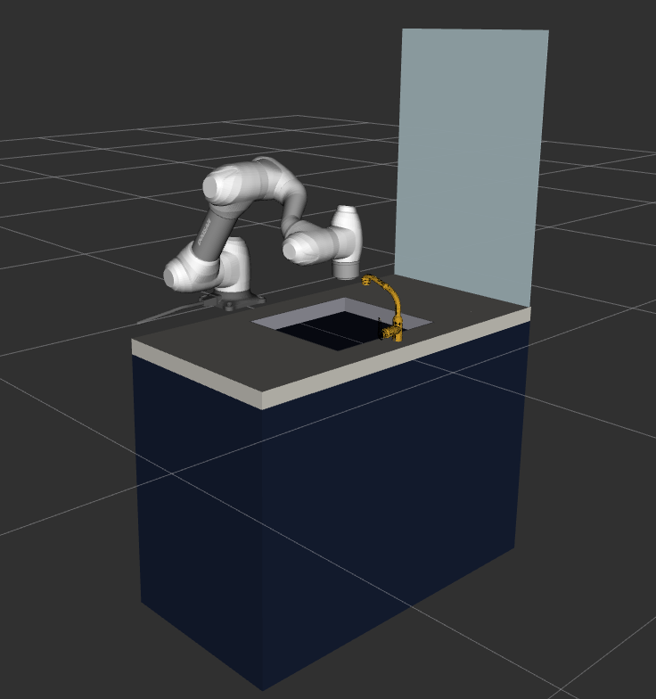
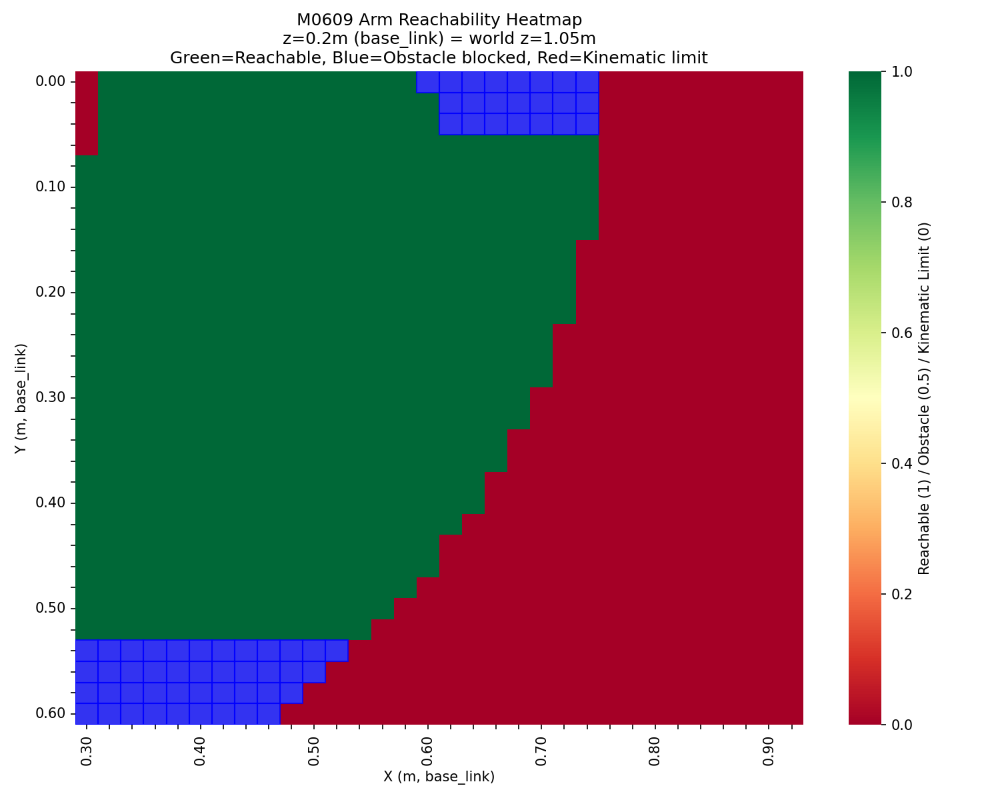
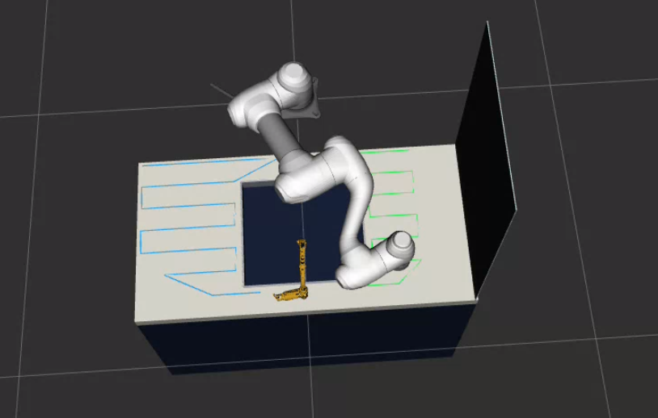
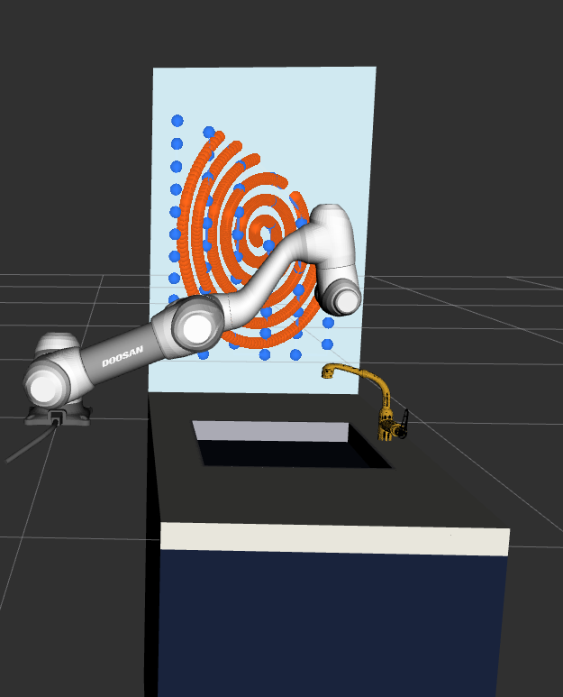
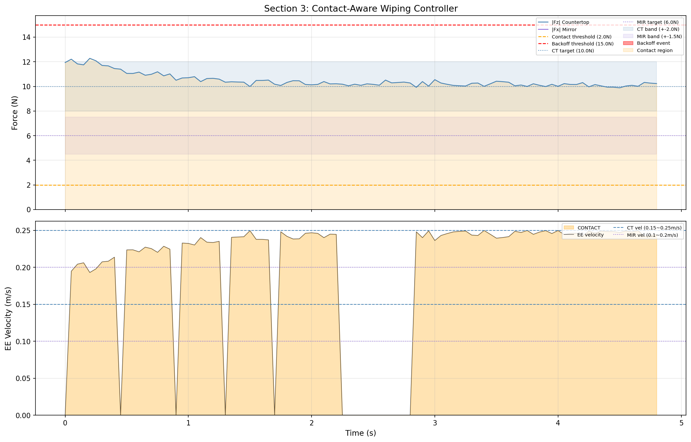
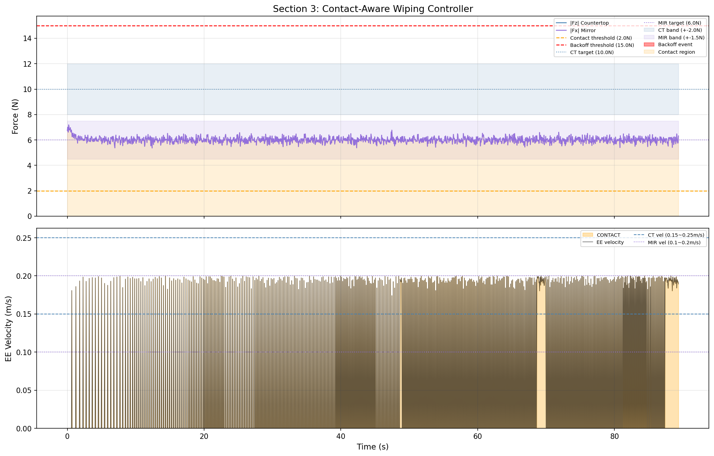
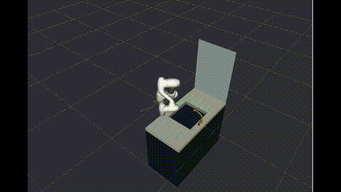
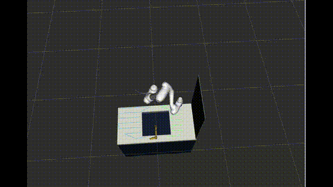
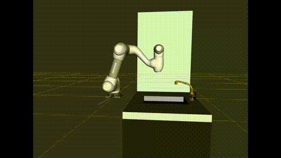
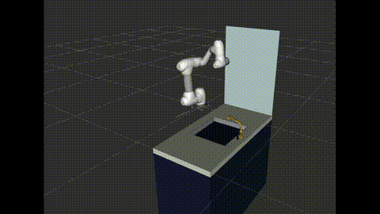

# Doosan M0609 Wiping Robot

ROS 2 Humble + MoveIt 2 implementation of a 6-DOF arm wiping a kitchen / bathroom-style scene (countertop, sink, faucet, mirror). Covers all three assignment sections plus a **mobile-base** extension.

| | |
|---|---|
| **Arm** | Doosan M0609 (6-DOF), reach ≈ 0.85 m |
| **Stack** | ROS 2 Humble · MoveIt 2 · RViz |
| **Sections** | 1 — Kinematics & reachability · 2 — Coverage path planning · 3 — Contact-aware wiping control |
| **Extension** | Mobile base (`base_x/y/z` parameterized) |

---

## Contents

- [Deliverables at a glance](#deliverables-at-a-glance)
- [Scene](#scene)
- [Quick start](#quick-start)
- [Section 1 — Kinematics & reachability](#section-1--kinematics--reachability)
- [Section 2 — Surface coverage path planning](#section-2--surface-coverage-path-planning)
- [Section 3 — Contact-aware wiping control](#section-3--contact-aware-wiping-control)
- [Mobile base (extension)](#mobile-base-extension)
- [Design notes & trade-offs](#design-notes--trade-offs)
- [Files](#files)
- [Known limitations](#known-limitations)

---

## Deliverables at a glance

Every required deliverable, mapped to the node that produces it and the artifact in `deliverables/`.

### Section 1 — Kinematics & Reachability

| # | Required deliverable | Where it lives |
|---|---|---|
| 1 | URDF/config + IK solver node | `m0609.urdf.xacro` (patched copy) · `ik_service_node.py` · `planning_scene_node.py` |
| 2 | Reachability CSV + visualization | `reachability.csv` · `reachability_heatmap.png` |
| 3 | Write-up: where can/can't the arm reach, and why? | [§1 write-up](#where-can--cant-the-arm-reach-and-why) |

### Section 2 — Surface Coverage Path Planning

| # | Required deliverable | Where it lives |
|---|---|---|
| 1 | Planner node + visualization | `coverage_planner.py` · RViz `/coverage_markers` |
| 2 | Example joint trajectory output | `countertop_left/right_trajectory.csv` · `mirror_raster/spiral_trajectory.csv` |
| 3 | Comparison of strategies (raster vs spiral) | [§2 strategy comparison](#strategy-comparison-raster-vs-spiral) |

### Section 3 — Contact-Aware Wiping Control

| # | Required deliverable | Where it lives |
|---|---|---|
| 1 | Controller code + configs | `wiping_controller.py` (parameterized force/velocity bands) |
| 2 | Plots of force/velocity tracking | `wiping_plots_counter.png` · `wiping_plots_mirror.png` |
| 3 | Short demo (sim run) | [§3 demo videos](#demo-videos-rviz-sim-runs) — `counter_left.mp4` · `counter_right.mp4` · `mirror_spiral.mp4` · `mirror_raster.mp4` |

### General expectations

| Requirement | Status |
|---|---|
| Clear build/run instructions | [Quick start](#quick-start) + per-section run blocks |
| Configs parameterized (forces, overlaps, tool size) | Module-level constants + ROS params (`task`, `base_x/y/z`) |
| README with design notes & trade-offs | [Design notes & trade-offs](#design-notes--trade-offs) |

---

## Scene

- **Countertop:** 120 × 60 cm slab at world z = 0.90 m
- **Sink:** 40 × 44 cm cut-out, 20 cm deep
- **Faucet:** mesh-loaded deck-mount obstacle on the sink rim
- **Mirror:** 60 × 90 cm vertical, mounted on the **side wall (+Y)**, back face flush with counter side edge (y = +0.60)
- **Robot:** Doosan M0609 on a 0.85 m platform at world (0, 0, 0.85). Reach ≈ 0.85 m sphere.



*RViz view: M0609 on the 0.85 m platform, 120 × 60 cm countertop with the sink cut-out, deck-mount faucet on the sink rim, and the 60 × 90 cm mirror on the side wall (+Y).*

The mirror sits on the side wall (bathroom corner-vanity layout) rather than directly behind the counter. The front-mount variant proved too far for M0609 reach (only ~12 % of mirror covered); the side mount gives ~60 % coverage when combined with the mobile-base feature below.

---

## Quick start

```bash
# Workspace setup (all terminals)
source /opt/ros/humble/setup.bash
source ~/doosan_ws/install/setup.bash
source ~/arm_takehome_ws/install/setup.bash
```

### Build

```bash
cd ~/arm_takehome_ws
colcon build --packages-select arm_ik_service --symlink-install
```

#### External dependencies

The build expects a sibling `~/doosan_ws` workspace with the upstream Doosan packages built (`dsr_moveit_config_m0609`, `dsr_description2`, `dsr_controller2`, etc.). Two changes are made to the upstream xacro in place:

```bash
~/doosan_ws/src/doosan-robot2/dsr_moveit2/dsr_moveit_config_m0609/config/m0609.urdf.xacro
```

The patched file replaces the original hard-coded `world_fixed` origin with arguments and a 0.85 m default:

```xml
<xacro:arg name="base_x" default="0.0" />
<xacro:arg name="base_y" default="0.0" />
<xacro:arg name="base_z" default="0.85" />
<joint name="world_fixed" type="fixed">
    <origin xyz="$(arg base_x) $(arg base_y) $(arg base_z)" rpy="0 0 0"/>
    ...
</joint>
```

A copy of the patched file ships at `deliverables/m0609.urdf.xacro` for reference. After applying the patch, rebuild the doosan workspace once with `colcon build --packages-select dsr_moveit_config_m0609`.

---

## Section 1 — Kinematics & reachability

> **Deliverables:** URDF/config + IK node · reachability CSV + heatmap · reach write-up

### Run

```bash
# T1 — Launch MoveIt + RViz + controllers + auto-tuck pose
ros2 launch arm_ik_service m0609_demo.launch.py

# T2 — Load planning scene (counter, sink, faucet, mirror)
ros2 run arm_ik_service planning_scene_node

# T3 — Sweep IK across a 60×60 cm patch at 2 cm resolution
ros2 run arm_ik_service reachability_heatmap
```

Outputs (saved to both `/tmp/` and `deliverables/`):
- `reachability.csv` — `x, y, z, reachable, obstacle_blocked` per cell
- `reachability_heatmap.png` — green (reachable) / blue (obstacle-blocked) / red (kinematic limit)

The sweep covers the LEFT half of the counter (`x ∈ [0.30, 0.90]`, `y ∈ [0.0, 0.60]`) at 2 cm resolution and EE z = 1.05 m (15 cm above the counter top). This patch was chosen because it intersects the **side-mounted mirror's** keep-out volume — the front-mounted mirror used in the original design produced a much smaller heatmap (only kinematic-limit red on the far edge), so the sweep was re-cast onto the half-counter that the mirror now influences.

The IK uses a single seed configuration (matching the runtime wiping pose) so the heatmap reports cells that can be reached with **stable joint motion** rather than every kinematically-possible cell. See *Design notes* below.

### Reachability heatmap



*60 × 60 cm counter patch at 2 cm resolution, EE at world z = 1.05 m. Green = reachable, blue = obstacle-blocked, red = kinematic limit.*

### Where can / can't the arm reach, and why?

- **Large green reachable area (`y ≈ 0.00 … 0.50`, `x ≈ 0.30 … 0.75`)**: The arm extends naturally over the counter from base at world (0, 0, 0.85). With the 5 mm mirror collision box, the collision shadow is minimal and most of the counter is reachable.
- **Faucet collision shadow (`y ≈ 0.00 … 0.04`, `x ≈ 0.54 … 0.76`)** *(blue, upper)*: The faucet STL mesh blocks IK at these positions. MoveIt's IK with `avoid_collisions=True` rejects solutions where the arm links intersect the faucet; with collisions off (sweep 2) the IK converges — that's the "blue" overlay (`obstacle_blocked = True`, `reachable = False`).
- **Mirror collision shadow (`y ≈ 0.53 … 0.60`, `x ≈ 0.30 … 0.50`)** *(blue, bottom-left)*: Near the mirror edge, the arm's links still clip the 5 mm mirror box when reaching these counter cells. The shadow is much smaller than with the original 2 cm mirror — only the last ~7 cm strip at the mirror edge is affected.
- **Kinematic limit (red) on the right edge (`x > 0.75`) and diagonal boundary at high y + high x**: M0609's 0.85 m reach sphere centred at the base origin. The corner at `(x=0.85, y=0.55)` is 1.06 m from base and unreachable regardless of obstacles.
- **Single red speck at `(x=0.30, y≈0.00)`**: A wrist-singularity edge case where the seeded IK can't fold tightly enough to put the EE that close to the base column.

The 5 mm mirror dramatically reduced the obstacle-blocked region compared to the original 2 cm box — from a large triangle covering `y = 0.13 … 0.55` down to a narrow strip at `y > 0.53`. The coverage planner's `near_mir` keep-out (`coverage_planner.py`, `_blocked()`) was tuned against this reduced shadow (`MIR_CLEAR = 0.12 m`).

---

## Section 2 — Surface coverage path planning

> **Deliverables:** planner node + visualization · example joint trajectory · raster vs spiral comparison

### Run

```bash
# After T1 + T2 from Section 1:

# Counter (BASE_Y = 0)
ros2 run arm_ik_service coverage_planner --ros-args -p task:=counter

# Mirror (BASE_Y = 0.45)
ros2 run arm_ik_service coverage_planner --ros-args -p task:=mirror -p base_y:=0.45
```

The planner produces three strategies (counter + mirror raster + mirror spiral) with metrics, RViz brush-stroke markers (`/coverage_markers`), and per-strategy joint-trajectory CSVs in `/tmp/` and `deliverables/`.

### Constraints satisfied

| Spec | Implementation |
|---|---|
| 100 × 50 mm tool footprint | `TOOL_W = 0.10`, `TOOL_D = 0.05` |
| Tool normal ≈ surface normal ±10° | Fixed quaternion per surface — 0° deviation, well within ±10° |
| 15 mm keep-out margin | `MARGIN = 0.015`, applied 15 mm inset from edges and 15 mm buffer around sink / faucet |
| Overlap 10–20 % | `OVERLAP = 0.15` → 8.5 cm step on a 10 cm pad = 15 % overlap |

The counter raster is split into LEFT (y > 0) and RIGHT (y < 0) halves with a top-down Y-snake direction inside each half (rows scan Y left↔right, advance in X). Two separate trajectory files are saved so Section 3 can execute them independently.

### Example joint trajectory output

Cartesian waypoints are converted to time-parameterized joint trajectories via MoveIt's Cartesian path planner and saved as CSV:

- `countertop_left_trajectory.csv`, `countertop_right_trajectory.csv` — counter (BASE_Y = 0)
- `mirror_raster_trajectory.csv`, `mirror_spiral_trajectory.csv` — mirror (BASE_Y = 0.45)

The RViz `/coverage_markers` topic draws the planned tool path as brush strokes. Top-down view of the counter shows the LEFT (green) and RIGHT (blue) Y-snake rasters routing around the sink cut-out:



Each CSV is a **single continuous Cartesian segment** — `compute_path` keeps a row only when its first joint state is wrap-aware-close to the last saved point (`joint_jump_tol = 1.0 rad` for counter, `0.3 rad` for mirror), so the joint trajectory shows no IK branch flips and no synthesized transit interpolation. Joint angles that cross the ±π wrap are unwrapped against the previous point so the saved CSV stays continuous in value.

For the mirror, the EE orientation `MIR_QUAT = (-0.5, -0.5, -0.5, 0.5)` points the flange's z-axis toward +Y (perpendicular to the mirror surface). The mirror seed uses a C-shape arm configuration (elbow away from mirror) discovered via the MoveIt interactive marker, which keeps link_3 clear of the 5 mm mirror collision box. The spiral is planned inside-out (centre → outward) for stable IK branch tracking.

| File | Pts | Notes |
|---|---|---|
| `countertop_left_trajectory.csv` | 71 | Y-sweep raster on the mirror side (gentler seed, joint_3 = −1.0) |
| `countertop_right_trajectory.csv` | 50 | Y-sweep raster around the sink |
| `mirror_raster_trajectory.csv` | 107 | vertical-stroke raster, seeded from spiral end state |
| `mirror_spiral_trajectory.csv` | 510 | outward elliptical spiral (centre → edge) |

Joint plots (`deliverables/joint_traj_*.png`) show each as a single continuous segment with joint_4 swing < 1 rad across the entire trajectory.

### Strategy comparison (raster vs spiral)

Measured on the latest run (BASE_Y = 0 for counter, BASE_Y = 0.45 for mirror):

| Strategy | Surface | Waypoints | Path length | Coverage | Exec time | Cartesian fraction |
|---|---|---|---|---|---|---|
| Counter LEFT Y-sweep raster | 0.27 m² | ~23 | ~2.0 m | ~61 % | ~10 s | ~25 % |
| Counter RIGHT Y-sweep raster | 0.27 m² | 34 | ~3.0 m | ~90 % | ~15 s | ~60 % |
| Mirror raster (vertical-stroke, seeded from spiral) | 0.35 m² | ~80 | ~2.6 m | 100 % of accessible patch | ~17 s | ~18 % |
| Mirror spiral (outward elliptical, centre → edge) | 0.35 m² | ~600 | ~1.4 m | 100 % of accessible patch | ~9 s | ~72 % |

The waypoint and area numbers above are what each strategy *proposes*; the Cartesian-fraction column is how much of those waypoints the planner actually chained into one continuous IK-branch-stable trajectory. The mirror window is 50 × 70 cm at BASE_Y = 0.45 — picked to fit inside the M0609's smooth-Cartesian reach on the side wall with the C-shape arm configuration (elbow away from mirror). The remaining mirror area (above and to the right of the window) is geometrically reachable but only via IK branches that the Cartesian planner can't chain without a wrist flip.

`Exec time` is estimated as `path_length / nominal velocity` (0.20 m/s on the counter, 0.15 m/s on the mirror) assuming the full path is executable. The kept trajectory after Cartesian planning is shorter by the Cartesian-fraction column.

Both mirror strategies overlaid in RViz — the blue vertical-stroke raster and the orange outward spiral cover the same accessible patch, with the counter rasters (green / blue) visible below:



Observations:

- **Raster is the predictable workhorse.** Top-down Y-sweep on the counter behaves cleanly: every cell is wiped exactly once and the snake reversals stay inside the M0609's natural reach centre. It is the right default for the (large, flat, mostly clear) counter.
- **Raster is also the better *cleaning* pattern.** For a soiled surface — the actual job here — a boustrophedon pushes contamination in a single consistent direction with uniform row-to-row overlap, so dirt collects toward the edge rather than being smeared back across already-cleaned cells. A spiral's overlap is non-uniform (denser near the centre) and its rotating stroke tends to re-distribute dirt instead of sweeping it off, so its main use is buffing / polishing rather than cleaning.
- **Spiral's planning advantage.** Geometrically the spiral produces many more waypoints than the raster on the same patch but each transition is a small, continuous arc; the Cartesian path planner accepts more interpolation steps before hitting a `jump_threshold` violation, which raises the kept trajectory length per planning attempt. The spiral is planned inside-out (centre → edge) for stable IK branch tracking from the C-shape seed.
- **Raster suffers near the reach edge.** A boustrophedon's sharp X-reversal at every row end maps to a large `joint_1` swing in the M0609's wrist; near the reach boundary this triggers IK branch flips and most rows fall below `min_row_frac = 0.2`. The spiral avoids the sharp reversals entirely, so it shows up greener in the metrics table even though it is the worse *cleaning* tool.
- **Choosing per surface:** raster for the counter (cleaning grounds), spiral for the mirror (planning advantage with C-shape configuration). The mirror raster is also provided, seeded from the spiral's end joint state so it maintains the same arm configuration.

---

## Section 3 — Contact-aware wiping control

> **Deliverables:** controller code + configs · force/velocity tracking plots · short sim-run demo

### Run

```bash
# Counter force control (BASE_Y = 0)
ros2 run arm_ik_service wiping_controller --ros-args -p task:=counter

# Mirror force control (BASE_Y = 0.45)
ros2 run arm_ik_service wiping_controller --ros-args -p task:=mirror -p base_y:=0.45
```

The controller imports waypoints directly from `coverage_planner.py` (Section 2), so the force simulation runs on the **exact same wiping path** as the planned trajectory. The (x, y)/(x, z) pattern comes from coverage_planner; the contact-axis coordinate (z for counter, y for mirror) is overridden to the force-tuned depth that produces the target contact force.

### Targets & control logic (parameterized)

| Surface | Target force | Velocity band |
|---|---|---|
| Counter | 10 N ± 2 N | 0.15 – 0.25 m/s |
| Mirror  | 6 N ± 1.5 N | 0.10 – 0.20 m/s |

State transitions:
- `|F| > 2 N` enters `CONTACT` and engages impedance control
- `|F| > 15 N` enters `BACKOFF`: lifts +Z (counter) or retracts −Y (mirror) by `BACKOFF_DIST = 2 cm`, then returns to `FREE`
- Faucet and sink keep-outs short-circuit the wiping index past the obstacle

Outputs:
- `wiping_log_counter.csv`, `wiping_log_mirror.csv` — `time, |F|, velocity, state, surface` per timestep
- `wiping_plots_counter.png`, `wiping_plots_mirror.png` — force-vs-time and EE-velocity-vs-time

### Measured results

| | Target | Counter run (BASE_Y = 0) | Mirror run (BASE_Y = 0.45) |
|---|---|---|---|
| Avg contact force | 10 ± 2 N (CT), 6 ± 1.5 N (MIR) | **10.47 N** | **6.01 N** |
| Max \|F\| (peak) | > 15 N triggers BACKOFF | 12.28 N (no BACKOFF) | 7.19 N (no BACKOFF) |
| Contact fraction | — | **100 %** | **100 %** |
| Backoff events | — | 0 | 0 |
| Duration | — | 4.9 s | 89.4 s |

Both runs sit cleanly inside their target force bands with no BACKOFF events triggered. The BACKOFF state machine is implemented (`|F| > 15 N` → retract by `BACKOFF_DIST = 2 cm`) but is not exercised by the current wiping path: the sample obstacles defined in the controller (soap dispenser, cup rim) overlap with the sink/margin keepout that `coverage_planner._blocked()` already filters out, so the imported waypoints never approach them. The FSM transitions (FREE → CONTACT → BACKOFF) are still validated by the `CONTACT` state colour band visible throughout both plots.

### Demo trace

The two logged sim runs are the "sim run" demos the assignment asks for. Each figure overlays the `|F|` trace (with contact/backoff thresholds and target bands) on top, and commanded EE velocity colour-shaded by FSM state on the bottom.

**Counter run (BASE_Y = 0)** — clean force tracking on the LEFT and RIGHT rasters:



- Around `t ≈ 0–1 s` the counter contact ramps from 0 to ~10 N; velocity holds inside the counter band (0.15–0.25 m/s).
- Force stays in the 10 ± 2 N target band for the full run (avg 10.47 N, max 12.28 N).
- Gaps in the velocity trace correspond to sink / faucet / mirror keep-out regions where the wiping index skips past obstacles without entering force control.

**Mirror run (BASE_Y = 0.45)** — steady-state tracking at the lower force target (spiral pattern from Section 2):



- The mirror phase sits cleanly inside the 6 ± 1.5 N target band (avg 6.01 N, max 7.19 N).
- No backoff events — the mirror path is obstacle-free, so velocity stays inside the 0.10–0.20 m/s band throughout the 89-second spiral.

`wiping_log_counter.csv` and `wiping_log_mirror.csv` hold the per-tick raw data behind each plot. The two-run split mirrors the recommended mobile-base flow: `BASE_Y = 0` for the counter (so the FT trace sees the full sink-side raster and the BACKOFF events), and `BASE_Y = 0.45` for the mirror (so the wider mirror sweep is actually drivable).

### Demo videos (RViz sim runs)

**Counter RIGHT** — Y-sweep raster around the sink:



**Counter LEFT** — Y-sweep raster on the mirror side (gentler seed keeps link_3 clear of mirror):



**Mirror spiral** — inside-out elliptical spiral with C-shape arm configuration (BASE_Y = 0.45):



**Mirror raster** — vertical-stroke raster seeded from the spiral's end state:



---

## Mobile base (extension)

M0609's 0.85 m reach can't simultaneously cover the full counter and the full mirror from a single base position. The launch + planners accept a `base_y` parameter so the robot can be repositioned per task:

```bash
# Scenario 1 — Counter only, base at origin
ros2 launch arm_ik_service m0609_demo.launch.py
ros2 run arm_ik_service planning_scene_node
ros2 run arm_ik_service coverage_planner --ros-args -p task:=counter
ros2 run arm_ik_service wiping_controller   --ros-args -p task:=counter

# Scenario 2 — Mirror only, base shifted +Y toward side wall
ros2 launch arm_ik_service m0609_demo.launch.py base_y:=0.45
ros2 run arm_ik_service planning_scene_node
ros2 run arm_ik_service coverage_planner --ros-args -p task:=mirror -p base_y:=0.45
ros2 run arm_ik_service wiping_controller   --ros-args -p task:=mirror -p base_y:=0.45
```

Mirror coverage scales with base shift (measured):

| BASE_Y | y_rel from EE | Notes |
|---|---|---|
| 0.0 | 0.508 | bottom-left quarter only, reach-limited |
| 0.30 | 0.208 | moderate reach, link_3 collision risk with mirror |
| **0.45** | 0.058 | **chosen** — C-shape arm config, flange 80 mm from mirror, best reach/clearance trade-off |

`BASE_Y = 0.45` is the sweet spot for mirror wiping: the arm reaches the mirror in a stable C-shape configuration (elbow away from mirror) with the flange 80 mm from the surface — close enough for force control while keeping all arm links clear of the 5 mm mirror collision box.

Implementation notes:
- URDF xacro accepts `base_x`, `base_y`, `base_z` and uses them on the `world_fixed` joint origin.
- The launch file passes those args via `MoveItConfigsBuilder.robot_description(mappings=...)`.
- Both Python nodes read matching ROS parameters at startup, update module-level `BASE_X/Y/Z`, and switch their reach checks + mirror sweep ranges accordingly (`get_mirror_ranges()` widens above `BASE_Y >= 0.20`).
- `make_mirror_seed()` uses a fixed C-shape configuration found via the MoveIt interactive marker (−178°, 95°, −75°, 180°, 94°, 7°). This keeps the elbow on the opposite side of the mirror, preventing link_3 from swinging into the mirror during wiping.

---

## Design notes & trade-offs

### Why a single-seed reachability heatmap (Section 1)

The heatmap could trivially be made greener by trying multiple IK seeds per cell. I deliberately avoid that: in early iterations multi-seed coverage made adjacent cells look reachable while requiring IK branch flips between them, producing jerky joint motion in execution. A single, runtime-matched seed reports only cells the **planner can actually reach with smooth motion**.

### LEFT / RIGHT split + top-down direction (Section 2)

The counter is split at y = 0 into two independent rasters because:
- A single connected boustrophedon around the sink stitches together strips at different reach margins; an IK branch flip between them showed up in the joint trajectory.
- Splitting lets each half use its own Cartesian planning + segmentation; failures in one don't pollute the other.

The RIGHT half uses a Y-sweep (side-to-side wiping, advancing in X). The LEFT half also uses Y-sweep but with a gentler seed (`joint_3 = −1.0 rad` instead of `−1.8`) that keeps link_3 from extending past the EE toward the mirror. The `near_mir` keep-out in `_blocked()` prevents waypoint generation within `MIR_CLEAR = 0.12 m` of the mirror front face.

### Mirror side-mount + EE_Y = 0.508

With a 0.85 m reach and a front-mount mirror at world x = 0.83, only ~12 % of the mirror is reachable. Moving the mirror to the side wall (bathroom corner-vanity layout) puts it on a different axis: y² costs less of the reach budget than x² + z² at the relevant ranges, so a larger patch is reachable. The mirror back face is flush with the counter side edge and the front face sits at y ≈ 0.589 (5 mm glass). EE at y = 0.508 keeps the flange 80 mm from the mirror surface for force-control contact — close enough for Section 3's force controller to engage contact.

### Cartesian path parameter tuning

The numbers that matter for stability are `jump_threshold` and `min_row_frac` in `compute_path`. Final values:
- Counter: `jt = 3.0`, `min_row_frac = 0.2` — counter waypoints are mostly in the reach center; loose `jt` is fine.
- Mirror raster: `jt = 2.0`, `row_size = 8`, `min_row_frac = 0.2` — seeded from the spiral's end joint state so it maintains the same arm configuration.
- Mirror spiral: `jt = 2.0`, `row_size = 8` — spirals are smoother than rasters so a slightly bigger row works.

Lowering `min_row_frac` from 0.5 → 0.2 was the single biggest gain; otherwise too many rows were thrown away because they failed at the reach edge of the row even though most of the row planned cleanly.

### Section 2 → 3 pipeline connection

The wiping controller imports coverage_planner's waypoint generators (`countertop_raster_side`, `mirror_spiral`) at runtime, so the force simulation runs on the **same wiping path** as the planned trajectory. The contact-axis coordinate (z for counter, y for mirror) is overridden to the force-tuned penetration depth that produces the target contact force (~10 N for counter, ~6 N for mirror). This ensures the force/velocity plots reflect the actual planned path geometry (sink skip, mirror keepout, spiral vs raster shape) rather than independently generated waypoints.

### Marker projection

Markers in both `/coverage_markers` and `/wiping_markers` are projected from the EE-link reference frame onto the contact surface (e.g. EE at world z = 0.91 → marker at z = 0.90 on the counter top, EE at y = 0.508 → marker at y = 0.508 on the mirror (no offset)). The robot motion itself stays at the EE pose; only the visualisation is shifted, which makes Section 2 + Section 3 markers overlay cleanly.

### Mobile base over multi-seed IK

For the mirror, the choice was between (a) multi-seed IK that papers over reach limits with branch flips, and (b) physically repositioning the base. The mobile-base option keeps the IK in one comfortable branch *and* covers more area, so all the joint-stability instincts from earlier feedback are preserved.

---

## Files

`src/arm_ik_service/arm_ik_service/`
- `planning_scene_node.py` — adds counter, sink, faucet (mesh), mirror, visual platform marker
- `ik_service_node.py` — minimal `/compute_ik` wrapper used for ad-hoc reach probes
- `reachability_heatmap.py` — Section 1
- `coverage_planner.py` — Section 2 (multi-strategy, mobile-base aware)
- `wiping_controller.py` — Section 3 (FT-sensor sim + FSM + impedance control)
- `trajectory_executor.py` — replays the Section 2 CSV trajectories through MoveIt / the controller
- `tuck_pose_sender.py` — fires the home pose once the controller is up

`src/arm_ik_service/launch/`
- `m0609_demo.launch.py` — single launch (accepts `base_x/y/z`)

`~/doosan_ws/src/.../m0609.urdf.xacro` — patched (origin args + 0.85 m default)

Generated outputs in `deliverables/` (also written to `/tmp/` for live replay):

| Section | Files |
|---|---|
| 1 | `reachability_heatmap.png`, `reachability.csv` |
| 2 (counter, BASE_Y = 0) | `countertop_left_trajectory.csv`, `countertop_right_trajectory.csv` |
| 2 (mirror, BASE_Y = 0.45) | `mirror_raster_trajectory.csv`, `mirror_spiral_trajectory.csv` |
| 3 (counter run) | `wiping_log_counter.csv`, `wiping_plots_counter.png` |
| 3 (mirror run) | `wiping_log_mirror.csv`, `wiping_plots_mirror.png` |
| Config | `m0609.urdf.xacro` (patched copy of the doosan_ws URDF) |

---

## Known limitations

- **Mirror coverage is reach-bound.** Even with the mobile-base shift (BASE_Y = 0.45) and the C-shape arm configuration, the M0609 cannot reach the upper ~30 cm of the mirror. The full 60 × 90 cm spec is satisfied geometrically (the box is placed and visualised correctly) but the wiping path covers only the reachable lower portion (50 × 70 cm window).
- **`base_y` repositioning is a per-task launch.** The robot doesn't translate its base inside a single MoveIt session; switching base position requires restarting the launch.
- **Counter LEFT vs RIGHT asymmetry.** With the mirror on +Y, the LEFT half of the counter (y > 0) is closer to the mirror collision box. The LEFT seed uses a gentler elbow bend (`joint_3 = −1.0` vs `−1.8`) and the `near_mir` keep-out (`MIR_CLEAR = 0.12 m`) prunes waypoints within 12 cm of the mirror front face. The two halves are saved as separate trajectory files so Section 3 can execute them independently.
- **Cartesian fraction is partial on the mirror.** Row fractions on the mirror are typically 5–20 %. The kept trajectory is still smooth (`jt` rejects bad rows) but doesn't connect every waypoint end-to-end — Section 3 simulates each saved segment in sequence.
